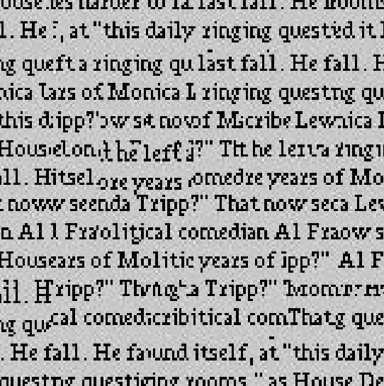
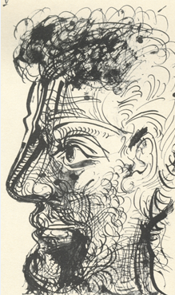
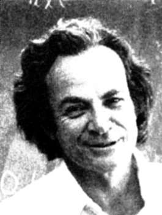
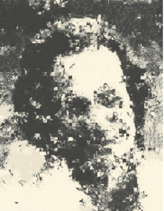

# Image Quilting for Texture Synthesis and Transfer
An implementation of the paper ["Image Quilting for Texture Synthesis and Transfer"](https://people.eecs.berkeley.edu/~efros/research/quilting/quilting.pdf).

## Example
### Image Quilting
```MATLAB
sample=imread("img\text_small.jpg");

out=image_quilting(sample,24,8,0.1);
```


### Texture Transfer
```MATLAB
sample=imread("img\sketch.tiff");
target=imread('img\feynman.tiff');

out=texture_transfer(sample,target,36,0.1,3);
```



